# Weasel（小狼毫）UI Style & Layout 参数速查手册

> 基于源码 `WeaselIPCData.h`、`RimeWithWeasel.cpp`、`WeaselPanel.cpp`、`HorizontalLayout.cpp` 分析整理
> 颜色格式默认 **ABGR**：`0xAABBGGRR`（Alpha-Blue-Green-Red）

---

## 目录

1. [整体结构总览](#1-整体结构总览)
2. [style/ — 全局样式参数](#2-style--全局样式参数)
3. [style/layout/ — 布局几何参数](#3-stylelayout--布局几何参数)
4. [Clamp（钳制）规则 ⚠️](#4-clamp钳制规则-)
5. [preset_color_schemes/ — 配色方案](#5-preset_color_schemes--配色方案)
6. [颜色继承链](#6-颜色继承链fallback)
7. [布局图解](#7-布局图解)

---

## 1. 整体结构总览

```yaml
patch:
  style:                          # ← 全局样式
    font_face: "..."
    layout:                       # ← 布局几何
      border_width: 2
      margin_x: 6
      ...
  preset_color_schemes:           # ← 配色方案定义
    my_scheme:
      name: "..."
      back_color: 0xFF...
      ...
```

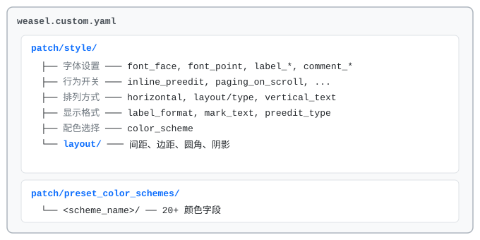

---

## 2. style/ — 全局样式参数

### 2.1 字体设置

| YAML 路径 | 类型 | 默认值 | 说明 |
|---|---|---|---|
| `style/font_face` | string | — | 候选词主字体，支持 `,` 分隔的 fallback 链 |
| `style/label_font_face` | string | = font_face | 序号字体，为空自动回退到 font_face |
| `style/comment_font_face` | string | = font_face | 注释字体，为空自动回退到 font_face |
| `style/font_point` | int | 12 | 候选词字号（pt），≤0 强制为 12 |
| `style/label_font_point` | int | = font_point | 序号字号 |
| `style/comment_font_point` | int | = font_point | 注释字号 |

> **字体 fallback 示例**：`font_face: "Microsoft YaHei, Segoe UI Emoji, Noto Color Emoji"`

### 2.2 行为开关

| YAML 路径 | 类型 | 默认值 | 说明 |
|---|---|---|---|
| `style/inline_preedit` | bool | false | 拼音串嵌入目标应用光标处 |
| `style/display_tray_icon` | bool | false | 显示系统托盘图标 |
| `style/ascii_tip_follow_cursor` | bool | false | ASCII 模式提示跟随光标 |
| `style/paging_on_scroll` | bool | false | 滚轮翻页（false = 选下一个候选词） |
| `style/enhanced_position` | bool | false | 增强候选框定位 |
| `style/click_to_capture` | bool | false | 鼠标点击候选项时截图 |

### 2.3 布局方向

| YAML 路径 | 类型 | 可选值 | 说明 |
|---|---|---|---|
| `style/horizontal` | bool | true/false | 候选词横排 / 竖排（快捷方式） |
| `style/fullscreen` | bool | true/false | 全屏模式（禁用 max_width、inline_preedit） |
| `style/vertical_text` | bool | true/false | 竖排文字模式 |
| `style/vertical_text_left_to_right` | bool | false | 竖排文字从左到右排列 |
| `style/vertical_text_with_wrap` | bool | false | 竖排文字自动换行 |
| `style/vertical_auto_reverse` | bool | false | 候选框在屏幕上方时自动反转排列 |
| `style/text_orientation` | string | horizontal / vertical | 文字方向（设 vertical 等同 vertical_text=true） |
| `style/layout/type` | string | 见下方枚举 | 布局类型（优先于 horizontal 等布尔值） |

**`layout/type` 枚举**：

| 值 | 说明 |
|---|---|
| `vertical` | 竖排候选词 |
| `horizontal` | 横排候选词 |
| `vertical_text` | 竖排文字（古文模式） |
| `vertical+fullscreen` | 竖排全屏 |
| `horizontal+fullscreen` | 横排全屏 |

> **优先级**：`layout/type` > `vertical_text` > `fullscreen` > `horizontal`

### 2.4 显示格式

| YAML 路径 | 类型 | 默认值 | 说明 |
|---|---|---|---|
| `style/label_format` | string | "%s." | 序号标签格式，`%s` 为序号占位符 |
| `style/mark_text` | string | "*" | 选中候选项前的标记文字 |
| `style/candidate_abbreviate_length` | int | 0 | 候选词超过此长度时截断（0=不截断） |

**`label_format` 示例**：

| 格式 | 效果 |
|---|---|
| `"%s."` | 1. 2. 3. |
| `"%s)"` | 1) 2) 3) |
| `"%s"` | 1 2 3 |
| `"(%s)"` | (1) (2) (3) |

### 2.5 预编辑模式

| YAML 路径 | 类型 | 可选值 | 说明 |
|---|---|---|---|
| `style/preedit_type` | string | composition / preview / preview_all | 预编辑显示模式 |

| 值 | 说明 |
|---|---|
| `composition` | 显示完整拼音编码（如 `ni'hao`） |
| `preview` | 只显示当前选中候选词的预览文字 |
| `preview_all` | 显示所有已确认 + 当前候选词的组合预览 |

### 2.6 其他

| YAML 路径 | 类型 | 可选值 | 说明 |
|---|---|---|---|
| `style/antialias_mode` | string | default / cleartype / grayscale / aliased / force_dword | 文字抗锯齿模式 |
| `style/hover_type` | string | none / semi_hilite / hilite | 鼠标悬停候选项的高亮行为 |
| `style/layout/align_type` | string | top / center / bottom | 候选项垂直对齐方式 |
| `style/color_scheme` | string | — | 指定使用的配色方案名（对应 preset_color_schemes 的 key） |

---

## 3. style/layout/ — 布局几何参数

### 3.1 参数总表

| YAML 路径 | 类型 | 单位 | 说明 |
|---|---|---|---|
| `border_width` / `border` | int | px | 窗口边框宽度 |
| `margin_x` | int | px | 水平外边距（可为负值，负值隐藏背景边缘） |
| `margin_y` | int | px | 垂直外边距（可为负值） |
| `spacing` | int | px | 预编辑行与候选列表之间的间距 |
| `candidate_spacing` | int | px | 候选词之间的间距（横排 = 左右间距，竖排 = 上下间距） |
| `hilite_spacing` | int | px | 序号标签与候选文字之间的间距 |
| `hilite_padding` | int | px | 高亮框内边距（同时设置 X 和 Y 的快捷方式） |
| `hilite_padding_x` | int | px | 高亮框水平内边距 |
| `hilite_padding_y` | int | px | 高亮框垂直内边距 |
| `corner_radius` | int | px | 候选窗口外框圆角半径 |
| `round_corner` / `hilited_corner_radius` | int | px | 候选项高亮色块圆角半径 |
| `shadow_radius` | int | px | 窗口阴影半径（0=不显示阴影） |
| `shadow_offset_x` | int | px | 阴影水平偏移 |
| `shadow_offset_y` | int | px | 阴影垂直偏移 |
| `min_width` | int | px | 窗口最小宽度 |
| `max_width` | int | px | 窗口最大宽度（0=不限制，全屏模式强制为 0） |
| `min_height` | int | px | 窗口最小高度 |
| `max_height` | int | px | 窗口最大高度 |
| `baseline` | int | px | 文字基线偏移 |
| `linespacing` | int | px | 行距 |

### 3.2 别名映射

| 写法 A（别名） | 写法 B（正式名） | 说明 |
|---|---|---|
| `border_width` | `border` | 同一参数，两种写法 |
| `round_corner` | `hilited_corner_radius` | 同一参数 |
| `hilite_padding` | → `hilite_padding_x` + `hilite_padding_y` | 同时设置两个方向 |

> **优先级**：如果同时设置了别名和正式名，**正式名优先**（如同时设 `border_width` 和 `border`，读取 `border`，回退到 `border_width`）。

---

## 4. Clamp（钳制）规则 ⚠️

> 源码位置：`RimeWithWeasel.cpp` 第 1308-1350 行

设置的值可能被自动修正为更大的值！这是最容易产生「设了值但没效果」的原因。

### 4.1 非竖排文字模式（horizontal / vertical / fullscreen）

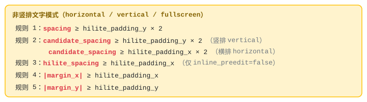

### 4.2 竖排文字模式（vertical_text）

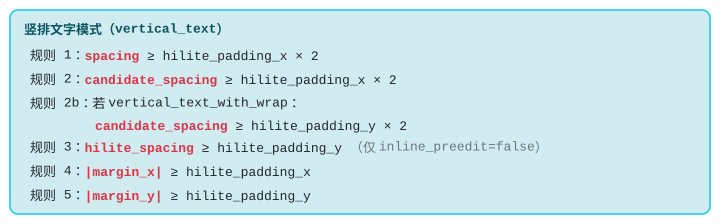

### 4.3 实用建议

> **`hilite_padding_x` 是横排模式下的"间距下限控制器"**
>
> 想要紧凑布局？先把 `hilite_padding_x` 设小（如 1），再调 `candidate_spacing` 和 `hilite_spacing`。
> 否则后两者会被钳制到 `hilite_padding_x` 或 `hilite_padding_x × 2` 的值。

| 你设的值 | hilite_padding_x | 实际生效值 | 原因 |
|---|---|---|---|
| `candidate_spacing: 5` | 4 | **8** | `max(5, 4×2)=8` |
| `hilite_spacing: 0` | 4 | **4** | `max(0, 4)=4` |
| `margin_x: 3` | 4 | **4** | `max(4, |3|)=4` |
| `candidate_spacing: 5` | 1 | **5** | `max(5, 1×2)=5` ✓ 如期望 |
| `hilite_spacing: 0` | 1 | **1** | `max(0, 1)=1` |

---

## 5. preset_color_schemes/ — 配色方案

### 5.1 颜色字段总表

| YAML 键名 | 作用目标 | 默认回退 |
|---|---|---|
| **窗口** | | |
| `back_color` | 候选区整体背景 | `0xFFFFFFFF`（白色） |
| `border_color` | 窗口边框颜色 | = text_color |
| `shadow_color` | 窗口阴影颜色 | `0x00000000`（透明） |
| **预编辑（输入串）** | | |
| `text_color` | 未选中输入串文字 | `0xFF000000`（黑色） |
| `hilited_text_color` | 选中输入串文字 | = text_color |
| `hilited_back_color` | 选中输入串背景 | = back_color |
| `hilited_shadow_color` | 选中输入串阴影 | `0x00000000` |
| **候选词（非选中项）** | | |
| `candidate_text_color` | 候选文字颜色 | = text_color |
| `candidate_back_color` | 候选背景颜色 | `0x00000000`（透明） |
| `candidate_shadow_color` | 候选阴影颜色 | `0x00000000` |
| `candidate_border_color` | 候选边框颜色 | `0x00000000` |
| **候选词（选中项）** | | |
| `hilited_candidate_text_color` | 选中候选文字 | = hilited_text_color |
| `hilited_candidate_back_color` | 选中候选背景 | = hilited_back_color |
| `hilited_candidate_shadow_color` | 选中候选阴影 | `0x00000000` |
| `hilited_candidate_border_color` | 选中候选边框 | `0x00000000` |
| **序号** | | |
| `label_color` | 序号文字颜色 | blend(candidate_text, candidate_back) |
| `hilited_label_color` | 选中序号文字颜色 | blend(hilited_cand_text, hilited_cand_back) |
| **注释** | | |
| `comment_text_color` | 注释文字颜色 | = label_color |
| `hilited_comment_text_color` | 选中项注释颜色 | = hilited_label_color |
| **标记 & 翻页** | | |
| `hilited_mark_color` | 选中标记 (mark_text) 颜色 | `0x00000000` |
| `prevpage_color` | 上一页箭头 `<` 颜色 | `0x00000000`（透明=不显示） |
| `nextpage_color` | 下一页箭头 `>` 颜色 | `0x00000000`（透明=不显示） |

### 5.2 颜色格式说明

**默认 ABGR**（Weasel 默认）：


可通过 `color_format` 切换：

| color_format | 字节顺序 | 示例（纯红色） |
|---|---|---|
| `abgr`（默认） | `0xAA_BB_GG_RR` | `0xFF0000FF` |
| `argb` | `0xAA_RR_GG_BB` | `0xFFFF0000` |
| `rgba` | `0xRR_GG_BB_AA` | `0xFF0000FF` |

> 💡 **透明色技巧**：将任意颜色的 Alpha 设为 `00` 即可隐藏该元素。
> 例如 `candidate_back_color: 0x00000000` → 候选背景透明（只显示窗口背景色）。

---

## 6. 颜色继承链（Fallback）

当某个颜色字段未在配色方案中定义时，自动回退到下方箭头指向的值：

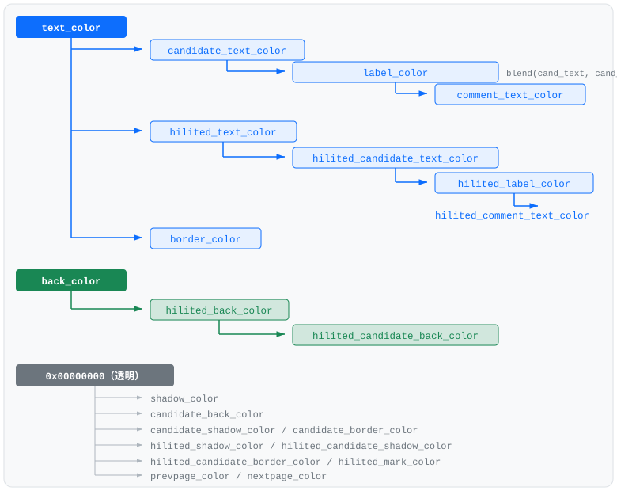

---

## 7. 布局图解

### 7.1 横排模式（horizontal）

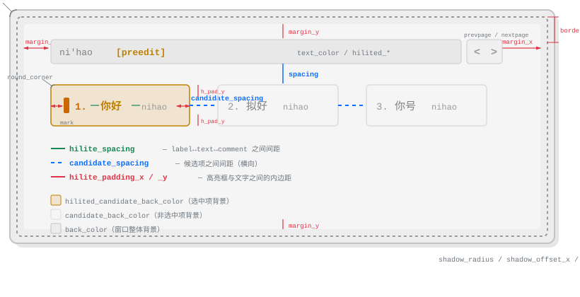

### 7.2 横排候选项内部结构

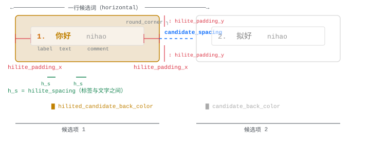

### 7.3 竖排模式（vertical）

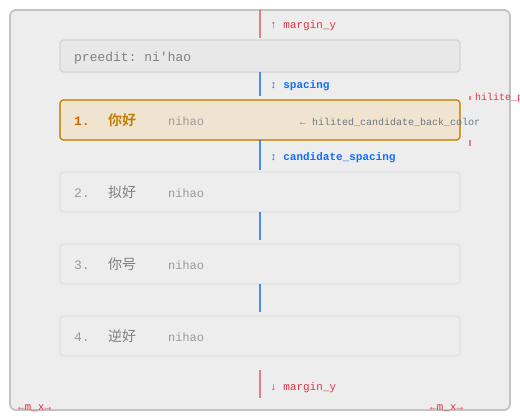

### 7.4 竖排文字模式（vertical_text）

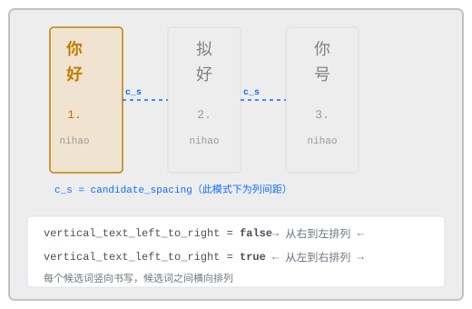

### 7.5 高亮框 padding 详解

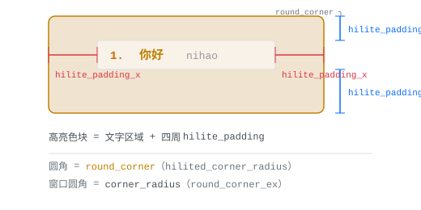

### 7.6 阴影效果

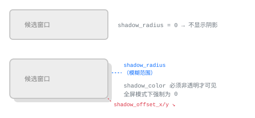

### 7.7 翻页指示器

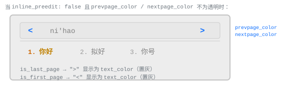

---

## 附：完整 YAML 配置模板

```yaml
patch:
  style:
    # ── 字体 ──
    font_face: "Microsoft YaHei"
    label_font_face: "Microsoft YaHei"
    comment_font_face: "Microsoft YaHei"
    font_point: 14
    label_font_point: 12
    comment_font_point: 11

    # ── 行为 ──
    horizontal: true
    inline_preedit: true
    display_tray_icon: true
    paging_on_scroll: true
    enhanced_position: true
    click_to_capture: false
    vertical_auto_reverse: false

    # ── 显示 ──
    label_format: "%s."
    mark_text: ""
    preedit_type: composition
    antialias_mode: default
    hover_type: semi_hilite
    color_scheme: my_scheme

    # ── 布局 ──
    layout:
      type: horizontal              # 或 vertical / vertical_text
      align_type: center            # top / center / bottom
      border_width: 1
      margin_x: 8
      margin_y: 6
      spacing: 4
      candidate_spacing: 12
      hilite_spacing: 2
      hilite_padding_x: 4
      hilite_padding_y: 4
      corner_radius: 6              # 窗口圆角
      round_corner: 4               # 高亮色块圆角
      shadow_radius: 6
      shadow_offset_x: 2
      shadow_offset_y: 2
      min_width: 100
      max_width: 600
      min_height: 0
      max_height: 0
      baseline: 0
      linespacing: 0

  preset_color_schemes:
    my_scheme:
      name: "我的配色"
      author: "me"
      # color_format: abgr          # 可选 abgr(默认)/argb/rgba
      # ── 窗口 ──
      back_color: 0xFFFFFFFF
      border_color: 0xFFCCCCCC
      shadow_color: 0x20000000
      # ── 输入串 ──
      text_color: 0xFF000000
      hilited_text_color: 0xFFCC6600
      hilited_back_color: 0xFFEEEEEE
      hilited_shadow_color: 0x00000000
      # ── 候选词 ──
      candidate_text_color: 0xFF333333
      candidate_back_color: 0x00000000
      candidate_shadow_color: 0x00000000
      candidate_border_color: 0x00000000
      # ── 选中候选 ──
      hilited_candidate_text_color: 0xFFCC6600
      hilited_candidate_back_color: 0xFFE8E8E8
      hilited_candidate_shadow_color: 0x00000000
      hilited_candidate_border_color: 0x00000000
      # ── 序号 ──
      label_color: 0xFF999999
      hilited_label_color: 0xFFCC6600
      # ── 注释 ──
      comment_text_color: 0xFF999999
      hilited_comment_text_color: 0xFF999999
      # ── 标记 & 翻页 ──
      hilited_mark_color: 0xFFCC6600
      prevpage_color: 0xFF999999
      nextpage_color: 0xFF999999
```

---

> 📖 本文档根据 Weasel 0.17.x 源码（`rime/weasel` master 分支）分析生成。
> 如遇参数不生效，请先检查 [Clamp 规则](#4-clamp钳制规则-)。
